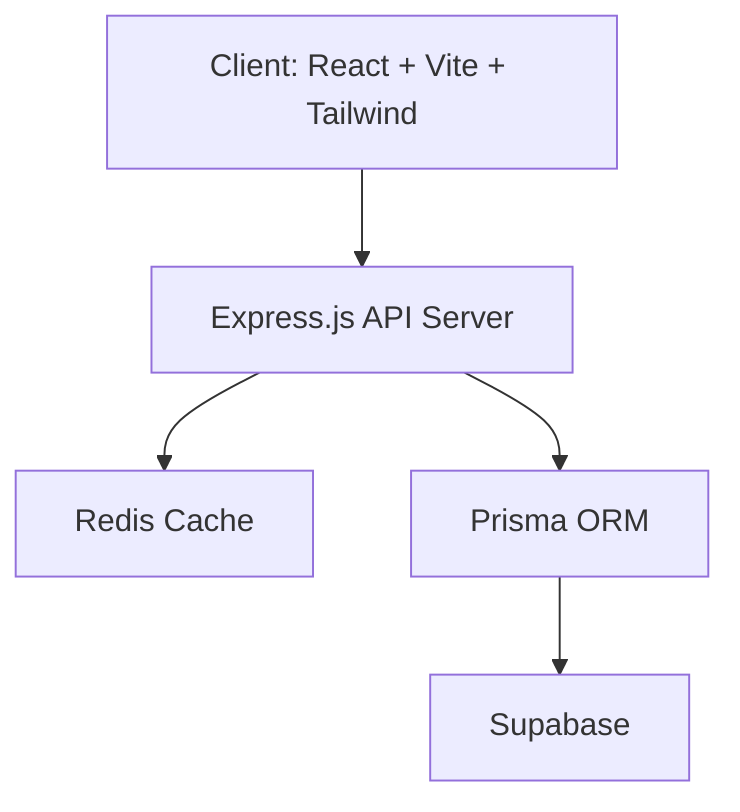

# URL Manager – Production-Grade URL Shortener 🚀  

A **Bitly-like production-ready URL shortener** built with modern best practices.  
Includes **authentication, analytics, Redis caching, secure APIs, and a React dashboard**.  

---

## 🔥 Features  
- ⚡ **Ultra-fast redirects** (<5ms cache-hit) using Redis.  
- 📊 **Advanced analytics**: click tracking, daily trends, referrer, device, and unique visitors.  
- 🔐 **Secure APIs**: JWT authentication, Zod validation, input normalization.  
- 🛡 **Rate limiting**: Prevents abuse (25 requests / 15 minutes per user).  
- 🖥 **Dashboard (React)**: Manage links, view stats, track user activity.
- 🐳 **Production practices**: Environment-based configs, Prisma migrations, error handling.

## 🛠 Architecture

📊 Example Analytics

- Total Clicks
- Daily Trends
- Referrer Sources
- Device Breakdown
- Unique Visitors

🔒 Security & Production Readiness

- ✅ Input validation with Zod
- ✅ Sanitized queries with Prisma
- ✅ Helmet + CORS + Rate limiting
- ✅ JWT-based authentication
- ✅ Redis caching for high-speed lookups
- ✅ Robust error handling & logging

🚀 Roadmap

- Docker + Nginx for deployment
- CI/CD setup (GitHub Actions)
- Custom domains for short links
- Link expiration & QR code generation
